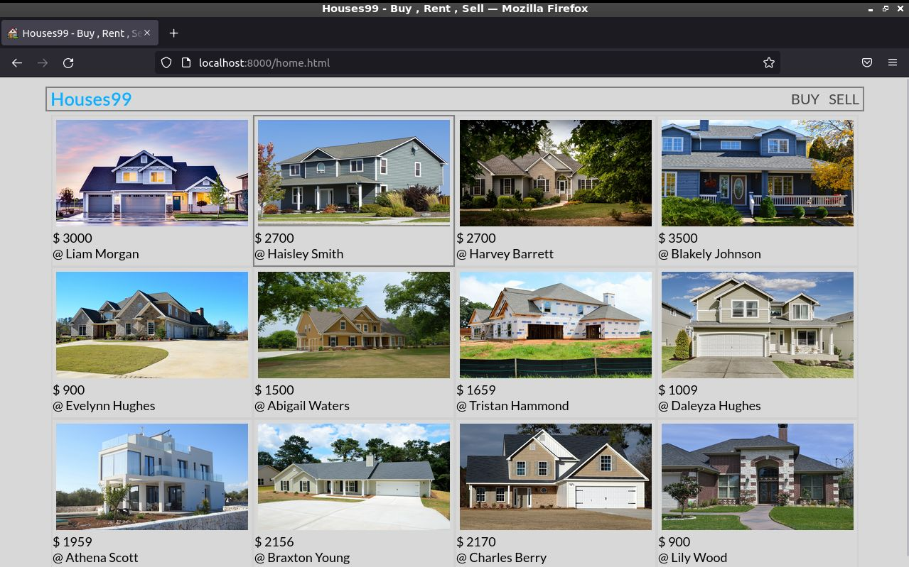

# Houses99
A real Estate website 

## running locally 
First run the web server by running 
```
python3 app.py 
```
By deafult the app will run on the port 5000 , To run the app on a different port edit the 
```python
    app.run(debug = True)
```
to 
```python
     app.run(host=yourhost, port=yourport)
```
After running the app go to the main folder and run the home.html file on any server you like 
Using python & http.server package 
```
python3 -m http.server
```

